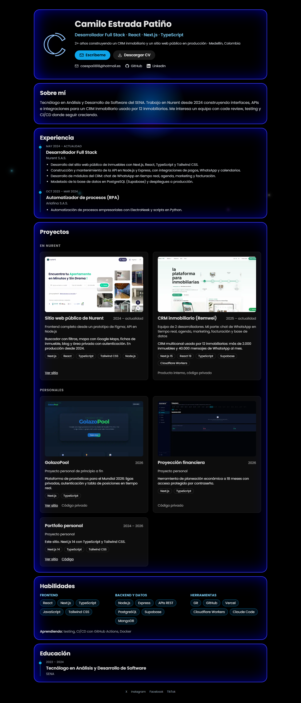

# Portfolio — Camilo Estrada Patiño

Sitio personal de una sola página: quién soy, experiencia, proyectos, habilidades y contacto.

**En producción:** https://camiloep.vercel.app



## Stack

- [Next.js 14](https://nextjs.org/) (App Router) y React 18
- TypeScript
- Tailwind CSS
- Framer Motion para las animaciones de entrada
- Desplegado en Vercel

## Cómo correrlo

Requiere Node.js 18.17 o superior.

```bash
npm install
npm run dev
```

Abre http://localhost:3000. No necesita variables de entorno.

Otros comandos:

```bash
npm run lint    # ESLint
npm run build   # build de producción
npm run start   # sirve el build
```

## Estructura

```
src/
  app/
    layout.tsx            metadatos (título, Open Graph) y fuente
    page.tsx              la página: hero, sobre mí, experiencia, educación, pie
    opengraph-image.tsx   imagen que se muestra al compartir el enlace
  components/
    Projects.tsx          tarjetas de proyectos
    Skills.tsx            habilidades agrupadas
    card.tsx              tarjeta con efecto de brillo
    Icons/                íconos SVG
  data/projects.ts        datos de los proyectos
  styles/globals.css      estilos del brillo y de las partículas
public/
  cv-camilo-estrada-patino.pdf
```

## Editar el contenido

Todo el contenido está escrito a mano en el código, sin llamadas a APIs externas:

- Experiencia, contacto y redes: `src/app/page.tsx`
- Proyectos: `src/data/projects.ts` (capturas en `public/projects/`, 1280×720)
- Habilidades: lista `SKILL_GROUPS` en `src/components/Skills.tsx`
- CV: reemplaza `public/cv-camilo-estrada-patino.pdf`

## Accesibilidad

- Encabezados reales (`h1`, `h2`, `h3`) y listas semánticas.
- Los SVG decorativos llevan `aria-hidden`.
- Con `prefers-reduced-motion` se ocultan las partículas y se desactivan las animaciones.
